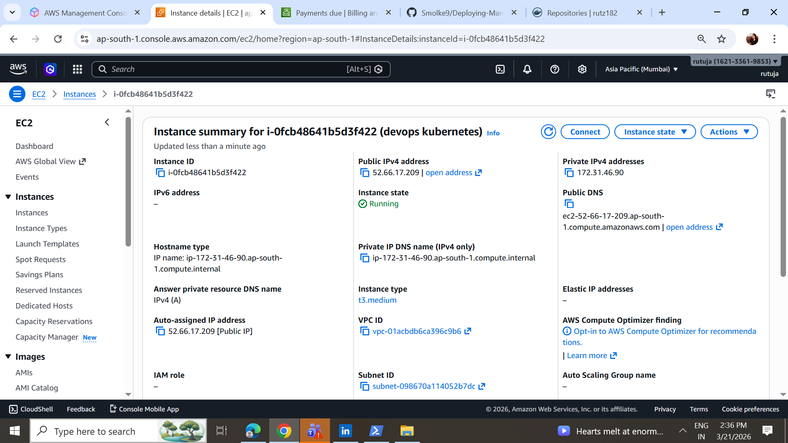
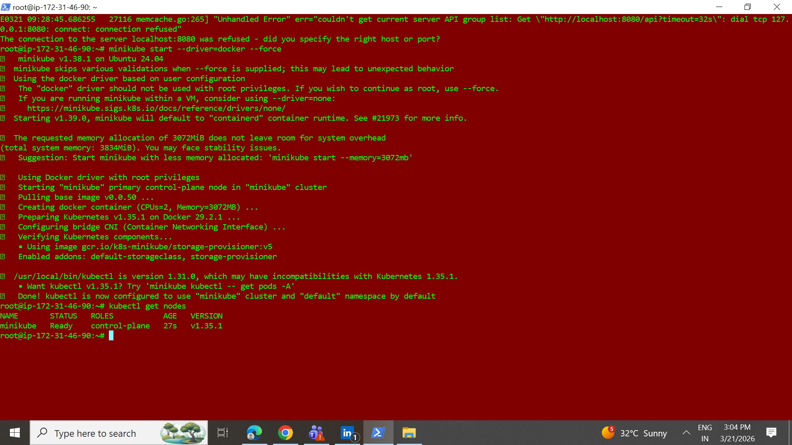
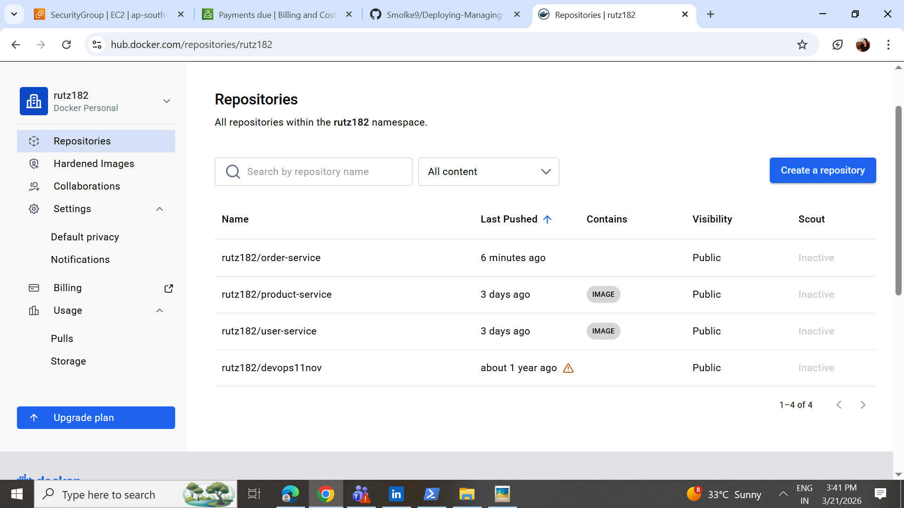
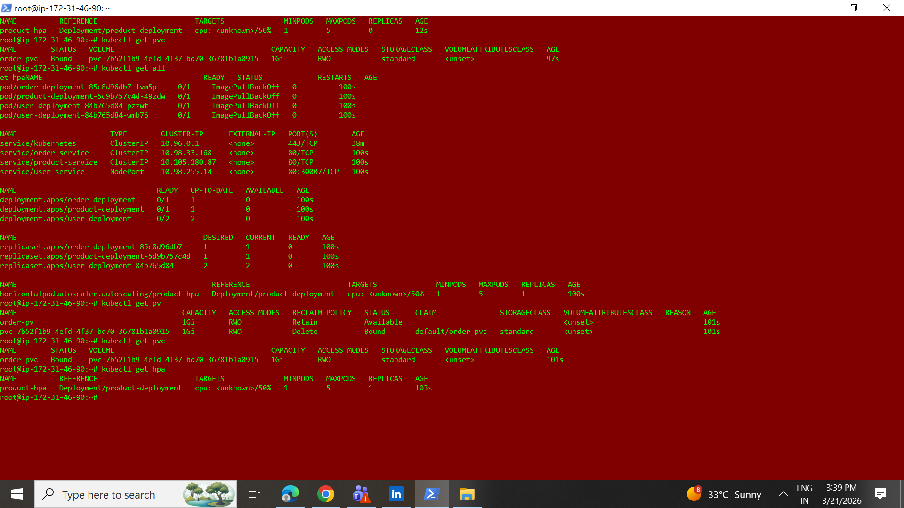

# 🚀 Deploying & Managing Microservices in a Cloud-Native Environment (Kubernetes)

This project demonstrates a **cloud-native microservices architecture** using **Docker + Kubernetes (Minikube)**.
It is designed for **learning, interviews, and real-world DevOps practice**.

---

## 🧱 Architecture Overview

We deploy **3 microservices**:

| Service | Type | Features |
|------|------|---------|
| User Service | Stateless | Simple REST API |
| Product Service | Stateless | HPA enabled |
| Order Service | Stateful | Persistent Volume (PV + PVC) |

### Key Kubernetes Concepts Used
- Dockerized microservices
- Kubernetes Deployments
- Kubernetes Services (Service Discovery)
- Horizontal Pod Autoscaler (HPA)
- Persistent Volumes & Persistent Volume Claims
- Metrics Server

---

## 📁 Project Structure

```
microservices-k8s/
│
├── user-service/
│   ├── app.py
│   └── Dockerfile
│
├── product-service/
│   ├── app.py
│   └── Dockerfile
│
├── order-service/
│   ├── app.py
│   └── Dockerfile
│
└── k8s/
    ├── deployments/
    │   ├── user-deployment.yaml
    │   ├── product-deployment.yaml
    │   └── order-deployment.yaml
    │
    ├── services/
    │   ├── user-service.yaml
    │   ├── product-service.yaml
    │   └── order-service.yaml
    │
    ├── hpa/
    │   └── product-hpa.yaml
    │
    └── storage/
        ├── order-pv.yaml
        └── order-pvc.yaml
```

---

## 1️⃣ Kubernetes Setup (Minikube)

### 🔹 Prerequisites

```bash
sudo apt update
sudo apt install docker.io -y
sudo systemctl start docker
sudo usermod -aG docker $USER
newgrp docker
```

### Install kubectl
```bash
curl -LO https://storage.googleapis.com/kubernetes-release/release/$(curl -s https://storage.googleapis.com/kubernetes-release/release/stable.txt)/bin/linux/amd64/kubectl
chmod +x kubectl
sudo mv kubectl /usr/local/bin/
```

### Install Minikube
```bash
curl -LO https://storage.googleapis.com/minikube/releases/latest/minikube-linux-amd64
sudo install minikube-linux-amd64 /usr/local/bin/minikube
```

### Start Cluster
```bash
minikube start --driver=docker
kubectl get nodes
```

### Enable Metrics Server (Required for HPA)
```bash
minikube addons enable metrics-server
```

---

## 2️⃣ Docker Image Build & Push

```bash
docker build -t rutuz182/user-service ./user-service
docker build -t rutuz182/product-service ./product-service
docker build -t rutuz182/order-service ./order-service

docker login
docker push rutuz182/user-service
docker push rutuz182/product-service
docker push rutuz182/order-service
```

---


## 3️⃣ Kubernetes YAML Files

### 🟢 User Deployment
`k8s/deployments/user-deployment.yaml`
```yaml
apiVersion: apps/v1
kind: Deployment
metadata:
  name: user-deployment
spec:
  replicas: 2
  selector:
    matchLabels:
      app: user
  template:
    metadata:
      labels:
        app: user
    spec:
      containers:
      - name: user
        image: rutuz182/user-service
        ports:
        - containerPort: 5000
```

### 🟢 Product Deployment (HPA enabled)
```yaml
apiVersion: apps/v1
kind: Deployment
metadata:
  name: product-deployment
spec:
  replicas: 1
  selector:
    matchLabels:
      app: product
  template:
    metadata:
      labels:
        app: product
    spec:
      containers:
      - name: product
        image: rutuz182/product-service
        ports:
        - containerPort: 5000
        resources:
          requests:
            cpu: "100m"
          limits:
            cpu: "500m"
```

### 🟢 Order Deployment (Persistent Storage)
```yaml
apiVersion: apps/v1
kind: Deployment
metadata:
  name: order-deployment
spec:
  replicas: 1
  selector:
    matchLabels:
      app: order
  template:
    metadata:
      labels:
        app: order
    spec:
      containers:
      - name: order
        image: rutz182/order-service
        ports:
        - containerPort: 5000
        volumeMounts:
        - mountPath: /data
          name: order-volume
      volumes:
      - name: order-volume
        persistentVolumeClaim:
          claimName: order-pvc
```

---

## 4️⃣ Services

### User Service (NodePort)
```yaml
apiVersion: v1
kind: Service
metadata:
  name: user-service
spec:
  selector:
    app: user
  ports:
  - port: 80
    targetPort: 5000
  type: NodePort
```

### Product & Order Services (ClusterIP)
```yaml
type: ClusterIP
```

---

## 5️⃣ HPA Configuration

```yaml
apiVersion: autoscaling/v2
kind: HorizontalPodAutoscaler
metadata:
  name: product-hpa
spec:
  scaleTargetRef:
    apiVersion: apps/v1
    kind: Deployment
    name: product-deployment
  minReplicas: 1
  maxReplicas: 5
  metrics:
  - type: Resource
    resource:
      name: cpu
      target:
        type: Utilization
        averageUtilization: 50
```

---

## 6️⃣ Persistent Storage

### Persistent Volume
```yaml
apiVersion: v1
kind: PersistentVolume
metadata:
  name: order-pv
spec:
  capacity:
    storage: 1Gi
  accessModes:
    - ReadWriteOnce
  hostPath:
    path: /mnt/data
```

### Persistent Volume Claim
```yaml
apiVersion: v1
kind: PersistentVolumeClaim
metadata:
  name: order-pvc
spec:
  accessModes:
    - ReadWriteOnce
  resources:
    requests:
      storage: 1Gi
```

---

## 7️⃣ Apply Kubernetes Resources

```bash
kubectl apply -f k8s/storage/
kubectl apply -f k8s/deployments/
kubectl apply -f k8s/services/
kubectl apply -f k8s/hpa/
```

---

## 8️⃣ Verification

```bash
kubectl get all
kubectl get pv
kubectl get pvc
kubectl get hpa
```

---



### 👨‍💻 Author
**Rutuja Patil**  
AWS | DevOps 
